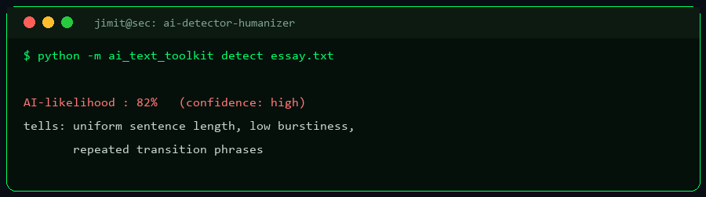

# AI Detector & Humanizer

[](https://github.com/JIMIT-PARIKH-01/ai-detector-humanizer/actions/workflows/ci.yml)
 

Two complementary tools in one project, with a **GUI and a CLI**, built on the Python
standard library (open-source ML models optional):

1. **AI detector** — estimates how likely text is AI-generated, as a **percentage with a
   confidence level** (heuristics + optional open-source model **ensemble**).
2. **Humanizer** — rewrites stiff, generic AI-sounding text to read more naturally, and shows
   the **exact before→after conversion** plus a **measured before/after AI-% round-trip**.

Runs **fully offline with zero dependencies** by default. No paid API is used.

---



## ⚠️ Honest limitations (please read)

- **AI-text detection cannot be made 100% accurate** — by this tool or any other (commercial
  ones included). The percentage is a best-effort *estimate* with real false-positive and
  false-negative rates. **Never** use it to accuse anyone or make a high-stakes decision.
- **The humanizer is a readability/tone tool.** It does not promise to "beat" detectors and
  should not be used to misrepresent AI work as your own where that would be dishonest.

---

## Input any document

Paste text, or open a **`.pdf`** (needs `pip install pypdf`), **`.docx`**, **`.odt`**,
**`.html`**, **`.rtf`**, **`.txt`**, or **`.md`** — the tool extracts the text and analyzes it.

---

## Install & run

Nothing to install for the default offline mode — just **Python 3.8+**.

```powershell
# GUI (two tabs: Detect / Humanize) — double-click, or:
python ai_text_toolkit/gui.py

# CLI
python -m ai_text_toolkit detect   --file report.pdf
python -m ai_text_toolkit detect   --text "It is important to note that..."
python -m ai_text_toolkit humanize --file essay.docx --report --strength strong
```

Optional open-source model backends (higher accuracy; downloads weights on first use):

```powershell
pip install transformers torch sentencepiece   # detector + paraphraser models
pip install pypdf                               # PDF input
```

---

## How it works

- **Detector (heuristic):** explainable stylometric signals — burstiness, vocabulary richness,
  contractions, stock AI-phrase density, repeated sentence starters — combined into a 0–100%
  estimate with a confidence level.
- **Detector (ensemble / `auto`):** blends the heuristic with an open-source Hugging Face
  classifier when installed; falls back to heuristics automatically otherwise.
- **Humanizer (rules):** expands contractions, trims stock filler, swaps inflated words, and
  (at `strong`) breaks over-long sentences — with an optional open-source paraphrase model.

## Project layout

```
ai-detector-humanizer/
└── ai_text_toolkit/
    ├── ai_detector.py    # detection: heuristic + optional model, ensemble
    ├── ai_humanizer.py   # rewriting: rules + optional model, before/after report
    ├── docio.py          # extract text from pdf/docx/odt/html/rtf/txt/md
    ├── backends.py       # lazy open-source model loaders
    ├── common.py         # shared: config, tokenization, stats
    ├── cli.py            # command line (detect / humanize)
    ├── gui.py            # tkinter two-tab GUI
    ├── config.json  requirements.txt  run.bat
```

## ⬇️ Download & Install

**This is a public tool — download and use it on your device for free.**

```bash
# 1) Clone it
git clone https://github.com/JIMIT-PARIKH-01/ai-detector-humanizer.git
cd ai-detector-humanizer

# 2) ...or download a ZIP (no git needed)
#    https://github.com/JIMIT-PARIKH-01/ai-detector-humanizer/archive/refs/heads/main.zip

# 3) ...or install the command straight from GitHub
pip install git+https://github.com/JIMIT-PARIKH-01/ai-detector-humanizer.git
```

Then run it as shown in the usage section above (CLI `python -m ...`, or launch
the GUI via `run.bat`).

<details>
<summary><b>🔒 Requesting access to a private tool</b></summary>

Public tools install with the commands above. If a tool is **private**, access
is granted by the owner through GitHub — a static link cannot unlock private
code, only GitHub can:

1. **Request access** — open an [access request](https://github.com/JIMIT-PARIKH-01/JIMIT-PARIKH-01/issues/new?template=tool-access-request.md&title=Access+request:+ai-detector-humanizer) or message on
   [LinkedIn](https://www.linkedin.com/in/jimit-devangkumar-parikh/).
2. The owner reviews it and, if approved, **adds you as a collaborator** on the
   private repository.
3. GitHub then lets you clone / download it with your own account. Access is
   revoked the moment the owner removes you as a collaborator.

</details>

## License
MIT — see [LICENSE](./LICENSE).
